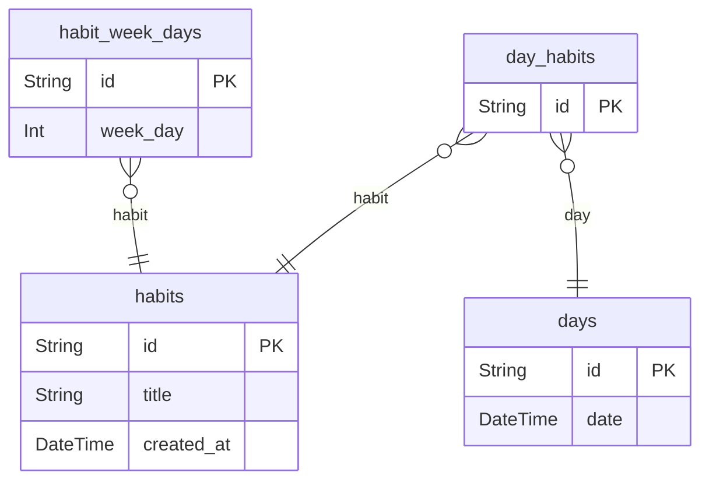

```mermaid
erDiagram

  habits {
    String id PK 
    String title  
    DateTime created_at  
    }
  

  habit_week_days {
    String id PK 
    Int week_day  
    }
  

  days {
    String id PK 
    DateTime date  
    }
  

  day_habits {
    String id PK 
    }
  
    habit_week_days o{--|| habits : "habit"
    day_habits o{--|| days : "day"
    day_habits o{--|| habits : "habit"
```
